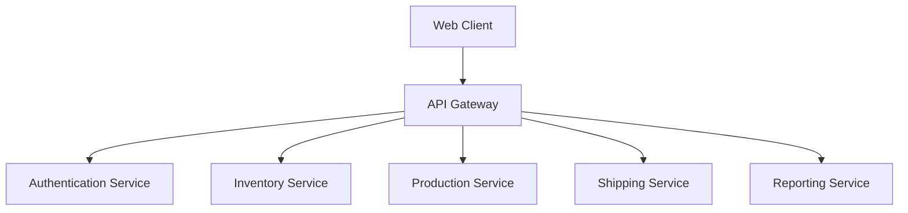

# Getting Started

### Reference Documentation

For further reference, please consider the following sections:

* [Official Gradle documentation](https://docs.gradle.org)
* [Spring Boot Gradle Plugin Reference Guide](https://docs.spring.io/spring-boot/3.4.2/gradle-plugin)
* [Create an OCI image](https://docs.spring.io/spring-boot/3.4.2/gradle-plugin/packaging-oci-image.html)
* [Spring Boot Testcontainers support](https://docs.spring.io/spring-boot/3.4.2/reference/testing/testcontainers.html#testing.testcontainers)
* [Testcontainers Postgres Module Reference Guide](https://java.testcontainers.org/modules/databases/postgres/)
* [Spring Data JPA](https://docs.spring.io/spring-boot/3.4.2/reference/data/sql.html#data.sql.jpa-and-spring-data)
* [Spring Boot DevTools](https://docs.spring.io/spring-boot/3.4.2/reference/using/devtools.html)
* [Flyway Migration](https://docs.spring.io/spring-boot/3.4.2/how-to/data-initialization.html#howto.data-initialization.migration-tool.flyway)
* [OAuth2 Client](https://docs.spring.io/spring-boot/3.4.2/reference/web/spring-security.html#web.security.oauth2.client)
* [Testcontainers](https://java.testcontainers.org/)

### Guides

The following guides illustrate how to use some features concretely:

* [Accessing Data with JPA](https://spring.io/guides/gs/accessing-data-jpa/)

### Additional Links

These additional references should also help you:

* [Gradle Build Scans – insights for your project's build](https://scans.gradle.com#gradle)

### Testcontainers support

This project
uses [Testcontainers at development time](https://docs.spring.io/spring-boot/3.4.2/reference/features/dev-services.html#features.dev-services.testcontainers).

Testcontainers has been configured to use the following Docker images:

* [`postgres:latest`](https://hub.docker.com/_/postgres)

Please review the tags of the used images and set them to the same as you're running in production.

* Web Client: This is the user interface that shop floor personnel will interact with to access the ERM system. It will likely be a web-based application that communicates with the backend services through the API Gateway.
* API Gateway: The API Gateway serves as the single entry point for the client applications. It is responsible for routing requests to the appropriate microservices, handling authentication, and potentially performing some basic request/response transformations.
* Authentication Service: This service is responsible for handling user authentication and authorization. It will manage user accounts, roles, and permissions, ensuring that only authorized personnel can access and modify the system's data.
* Inventory Service: The Inventory Service is the central hub for all inventory-related operations. It handles tasks such as receiving new inventory, tracking stock levels, managing material consumption, and providing inventory reporting.
* Production Service: The Production Service is responsible for logging and tracking the manufacturing process. This includes creating and managing work orders, recording production steps, capturing quality control data, and providing production analytics.
* Shipping Service: The Shipping Service manages the logistics of shipping finished products. It handles tasks like integrating with shipping carriers, recording shipment details, generating shipping documentation, and providing shipment tracking and reporting.
* Reporting Service: The Reporting Service aggregates data from the other microservices to provide advanced reporting and analytics capabilities. This will include customizable dashboards, historical trend analyses, and predictive forecasting.
* Message Broker: The Message Broker, such as RabbitMQ or Apache Kafka, enables asynchronous communication between the microservices. It allows the services to publish and subscribe to events, ensuring data consistency and reducing the need for tight coupling.
* Database Cluster: The database cluster stores all the critical data for the ERM system, including inventory, production, shipping, and user information. It likely consists of a relational database management system, such as PostgreSQL or MySQL, with appropriate replication and sharding to ensure scalability and high availability.