## Northshore CAD block details

```mermaid
stateDiagram-v2
    [*] --> PyExtract: Call Extractor
    
    LocateDWGs --> collectAndExtract
%%    collectAndExtract --> ElasticSearch
    PyExtract --> [*]
    
        
    state PyExtract {
        state start_state <<fork>>
        state end_state <<join>>
        state if_state <<choice>>
        filesInFile --> start_state: Read file list
        start_state --> if_state: Check for DWG files
        if_state --> end_state: No DWG files
        if_state --> LocateDWGs: Found DWG files
        end_state --> collectAndExtract
        collectAndExtract --> ElasticSearch: Send cleansed data to ElasticSearch
        ElasticSearch --> [*]: Done
    }
        
    state LocateDWGs {
        [*] --> if_state_in_locate: Check for DWG files
        state if_state_in_locate <<choice>>
        if_state_in_locate --> [*]: No DWG files
        if_state_in_locate --> lines:For each line
        lines --> line: Split
        line --> dwgFile: Copy over to working directory
        dwgFile --> dxfFile: Convert to DXF using ODAFileConverter appImage
        dxfFile --> [*]: Send to Extractor
    }
    state collectAndExtract {
        state fork_state <<fork>>
        openFile --> OpenTransaction: Open DXF file and ready for parse
        OpenTransaction --> GetBlockDetails: Use the BlockTable to get block details
        GetBlockDetails --> fork_state: does the block exist?
        
        fork_state --> collectBasicProperties: dxf File
        addToCSV --> fork_state:Check for more blocks
        collectBasicProperties --> collectExtents/Dimensions
        collectExtents/Dimensions --> collectAttributes
        collectAttributes --> readCustomData
        readCustomData --> addToCSV: Add to CSV for temporary storage
        addToCSV --> [*]: Prep for elasticsearch
    }

    state ElasticSearch {
        index
        search
    }
```



## UI Layout
Name,Description,Layer,Width,Height,EntityCount,HasAttributes,AttributeNames,Units,LastModified,Author,Category
Block1,"Simple shape",0,10.5,5.2,3,true,TAG1|TAG2,Imperial,2025-02-04 14:30:22,John,Shapes
Block2,"Complex part",PARTS,15.7,8.9,12,false,,Metric,2025-02-04 14:31:15,Jane,Parts

```
+------------------------+
| Search Box             |
+------------+----------+
| Block List | Preview  |
|            |          |
|            +----------+
|            |Properties|
|            |          |
|            +----------+
|            | Insert   |
+------------+----------+
```

