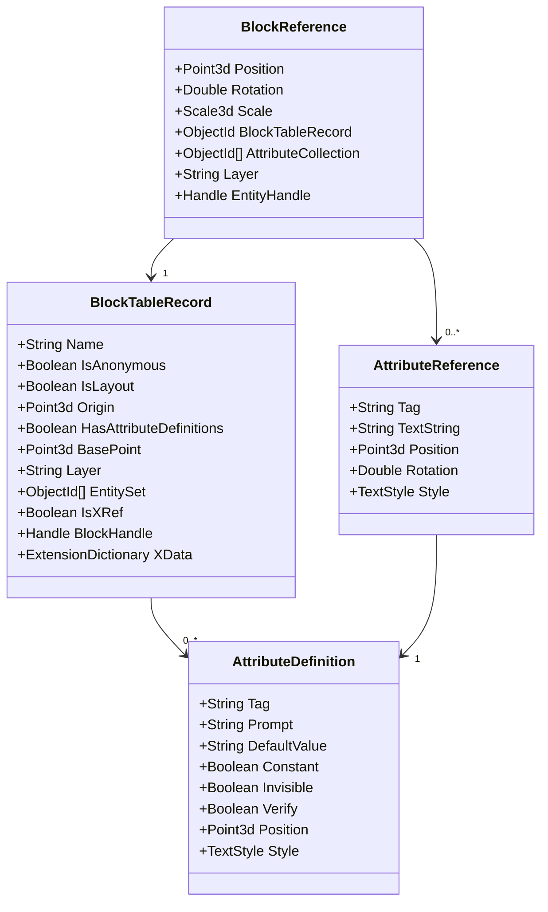

# Schema For Block Library

Let me explain each component of the Block schema:

Block Table Record (Block Definition):
- `Name`: Unique identifier for the block
- `Origin`: Base point coordinates (0,0,0 by default)
- `Layer`: Layer the block was created on
- `Entities`: Collection of objects that make up the block
- `Flags`: IsLayout, IsAnonymous, HasAttributes, etc.
- `XData`: Extended data (custom properties)
- `Handle`: Unique identifier in the DWG database

Block Reference (Block Insert):

Position: Insertion point coordinates
Rotation: Rotation angle in radians
Scale: X, Y, Z scale factors
BlockTableRecord: Reference to block definition
Attributes: Collection of attribute values
Layer: Layer the reference is on
Handle: Unique entity handle

Attribute Definition:

Tag: Attribute identifier
Prompt: User prompt text
DefaultValue: Initial value
Flags: Constant, Invisible, Verify
Position: Text location
Style: Text style properties

Attribute Reference:

Tag: Matches attribute definition tag
TextString: Current value
Position: Actual position in block reference
Style: Text appearance properties

Block-specific Data:

Geometry data for each entity
Visibility state
Dynamic block parameters
Dependencies
External references (if XRef)

Entity Data within Blocks:
CopyEntity {
Handle: Unique identifier
Owner: Block owner handle
Layer: Layer name
Color: Color index or RGB
Linetype: Line type name
Geometry: Entity-specific data
XData: Extended data
}